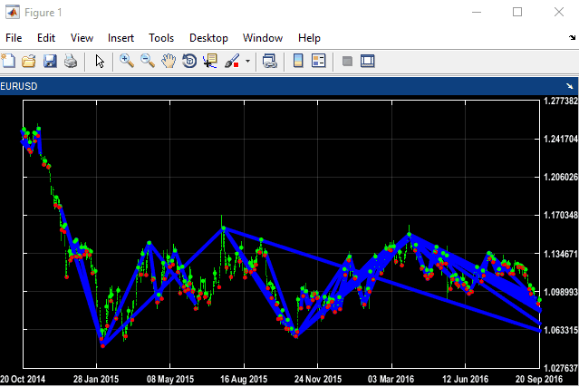

# Matlab-Widget-Collection
Explore some of my useful Matlab Widget

# AxesMove
the widget alow you :
1. move the axes with your mouse drag and drop
2. move the axes with the keyboard left and rigth keys
3. nice value tick display with the same position thet look great!
4. you can control the x value: date or value  
5. as the widget resize the tick adjust to the axes position.

made by oren berkovitch 2020 
orenber@hotmail.com

ther is more to come !......
